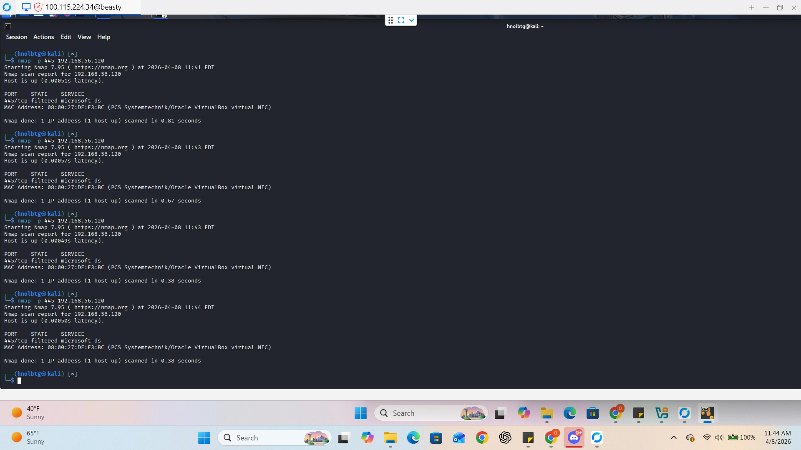

# Incident Response Report: SMB Vulnerability Mitigation
**Project:** Hybrid Private Cloud Architecture   
**Framework:** NIST SP 800-61 Rev. 2  
**Status:** Remediated  

---

## Phase 1: Preparation (The Baseline)
> **Functional Purpose:** Before an attack happens, we must ensure our "walls" are built correctly. This involves establishing secure configurations and monitoring tools to detect when someone is "knocking" on a door they shouldn't be.

* **Asset Identified:** Windows 10 Workstation (`192.168.56.20`).
* **Tooling:** Wazuh HIDS and pfSense Firewall logs.
* **Initial State:** Server Message Block (SMB v1/v2) active for file sharing across the local network.

## Phase 2: Detection & Analysis
> **Functional Purpose:** This is the "Security Camera" phase. We used the **Kali Linux** security testing node to simulate a brute-force attack on the SMB port. The goal was to see if our SIEM (Wazuh) would alert us to the unauthorized entry attempt.

* **The Trigger:** Brute-force simulation targeting Port 445 (SMB).
* **Evidence:** 
  * **Screenshot 1.0:** Demonstrates the successful execution of the attack utility against the target's SMB service.
* **Detection:** Wazuh triggered a **Level 10 Alert: Multiple Failed Logins**.
* **Analysis:** Analysis confirmed that the legacy SMB configuration allowed an attacker to enumerate user accounts, posing a severe risk to data integrity.

## Phase 3: Containment, Eradication, & Recovery
> **Functional Purpose:** This is the "Emergency Response." Once the leak is found, we patch the hole. We don't just stop the attack; we remove the vulnerability so it can never happen again.

* **Containment:** Temporarily isolated the Windows workstation from the internal network via pfSense rules to stop the brute-force attempt.
* **Eradication (Hardening):** 1. Disabled **SMB v1** (Legacy protocol with known vulnerabilities like EternalBlue).
    2. Forced **SMB Signing** and Encryption.
    3. Restricted Port 445 access to authorized management IPs only.
* **Recovery:** Restored network connectivity and verified that file sharing only functioned over encrypted channels.

## Phase 4: Post-Incident Activity (Lessons Learned)
> **Functional Purpose:** This is the "Debrief." We analyze the incident to understand the real-world business risks and ensure the vulnerability is permanently neutralized.

### **The Real-World Cost of Inaction**
Had the Hydra brute-force simulation transitioned into a live exploit in a production environment, the "Cloud Lab" would have faced the following impacts:

* **Ransomware Propagation (The WannaCry Scenario):** Legacy SMBv1 is a primary carrier for "wormable" malware. A single compromised node could have led to a total encryption of the Nextcloud data stores and local backups.
* **Data Exfiltration & Compliance Breach:** Because the legacy SMB connection was unencrypted, an attacker could have intercepted sensitive PII (Personally Identifiable Information) moving across the wire, leading to legal liabilities and loss of trust.
* **Lateral Movement:** The credentials harvested in our simulation would have allowed an attacker to move from the Windows workstation to the **pfSense** management gateway, resulting in a full network takeover.

### **Final Hardening Verification**
To ensure these risks are neutralized, we implemented the **SMB Hardening Standard**.
* **Result:** System hardened; SMBv1 disabled; Packet signing enforced. 
* **Final Status:** Verification scans from the Security Testing node now confirm the vulnerability is fully remediated.

