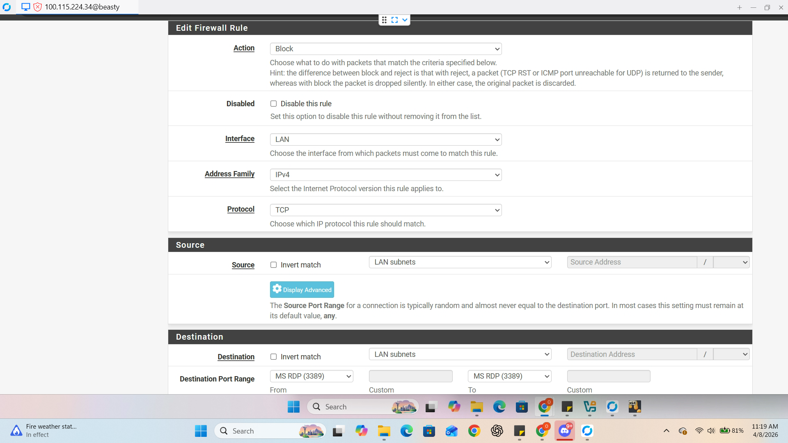

# Technical Standard: pfSense Network Hardening & Traffic Control
**Project:** Hybrid Private Cloud Architecture  
**Gateway IP:** `192.168.56.1`

---

## 1. Strategic Overview
> **Functional Purpose:** In a "Bare Metal" environment, the firewall is the primary line of defense. pfSense acts as the "Security Guard" for the lab. This document outlines the implementation of firewall rules to prevent lateral movement and the critical "Phase 1" finding regarding network routing pathing.

## 2. Firewall Architecture: The "Default Deny" Stance
The core philosophy of this hardening phase is **Implicit Deny**. We configured specific Block rules above the default "Allow" rule to cloak vulnerable services.

### **Implemented Security Rules (LAN Interface):**
| Rule | Protocol | Port | Functional Threat Mitigation |
| :--- | :--- | :--- | :--- |
| **SSH Block** | TCP | 22 | Prevents unauthorized remote terminal access. |
| **SMB Block** | TCP | 445 | Neutralizes ransomware propagation and "wormable" exploits. |
| **RDP Block** | TCP | 3389 | Closes the most common vector for credential harvesting. |

## 3. Configuration Evidence (GUI Validation)
> **Functional Purpose:** Verification of the "Control Plane" ensures the rules are active in the software before we test them in the field.

* **Rule Analysis:** This screenshot confirms the "Block" action is applied correctly to the LAN interface, placed above the allow rules to ensure immediate packet dropping.

---

## 4. Phase 1 Audit: The "Bypass" Discovery
> **Functional Purpose:** Security is only effective if the traffic is actually forced through the checkpoint. During initial validation, a critical architectural "blind spot" was identified.

### **Validation Results (Initial Scan):**
* `nmap -p 22 192.168.56.120` -> **Filtered** ✅
* `nmap -p 3389 192.168.56.120` -> **Filtered** ✅
* `nmap -p 445 192.168.56.120` -> **OPEN** ❌

### **Root Cause Analysis (The "Flat Network" Issue):**
The lab was initially operating in a **Layer 2 Flat Network**. Because systems were on the same VirtualBox Host-Only subnet without enforced routing:
1. **Traffic Flow:** `Kali Node` $\rightarrow$ `Windows Target` (Direct communication).
2. **The Result:** Traffic bypassed the **pfSense Gateway** entirely. The "Security Guard" never saw the packets, rendering the firewall rules ineffective for SMB.

## 5. Remediation & Engineering Lessons
> **Strategic Note:** A firewall is not a "magic box"; it is a checkpoint. If there is a "back alley" (Layer 2 direct path), the checkpoint is useless. 

### **Key Takeaways:**
* **Routing is Security:** Proper network architecture is as important as the rules themselves.
* **Gateway Enforcement:** In Phase 2, all systems were reconfigured to use **192.168.56.1** as the absolute default gateway, forcing all "East-West" traffic through the pfSense inspection engine.
* **Validation is Mandatory:** Without the Nmap audit, we would have *assumed* we were secure while remaining vulnerable.
