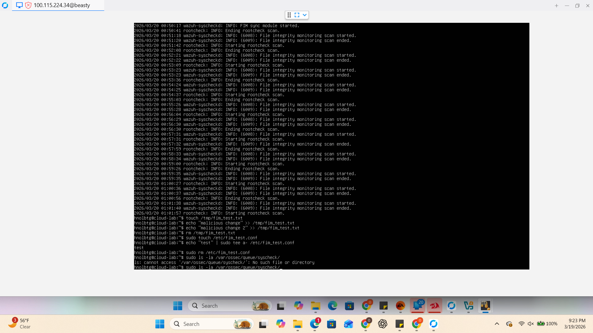
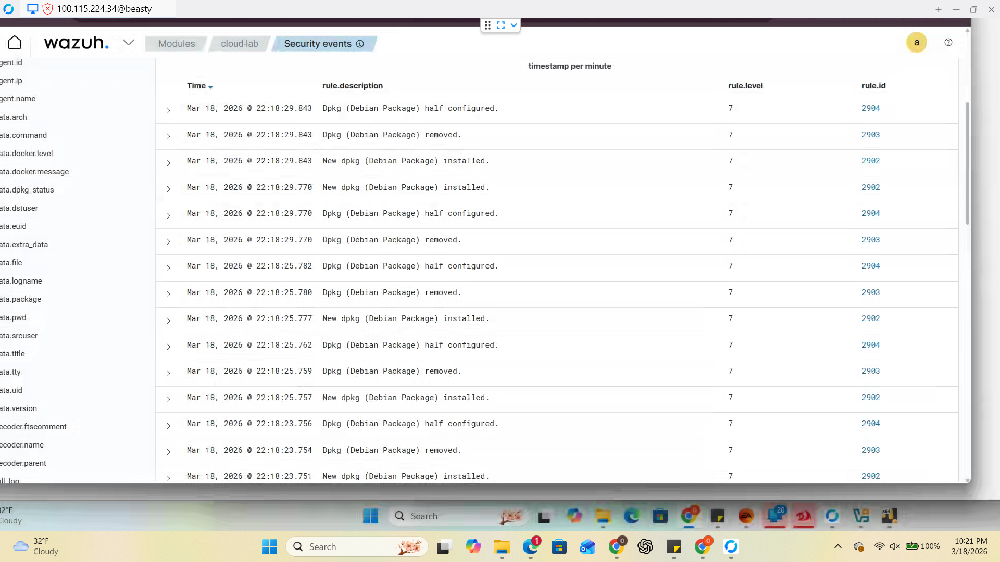

# Incident Response Report: File Integrity Violation (SOC / DFIR Style)
**Project:** Hybrid Private Cloud Architecture  
**Framework:** NIST SP 800-61 Rev. 2  
**Target Node:** `cloud-lab` (Ubuntu Server)  

---

## 1. Incident Summary
On March 19, 2026, a file integrity monitoring alert was triggered on the Linux endpoint `cloud-lab`. The alert indicated unauthorized file modification and deletion activity within a monitored directory.

---

## 2. Timeline of Events
| Time | Event Action | Evidence Source |
| :--- | :--- | :--- |
| **21:19:19** | Integrity Checksum Change Detected | Wazuh Syscheck |
| **21:20:22** | Unauthorized File Deletion Detected | Wazuh Syscheck |
| **Continuous** | Rootcheck scans executed to verify system state | Wazuh Manager |

---

## 3. Detection & Analysis (Evidence)
> **Functional Purpose:** This phase represents the "Security Camera" of our architecture. We use **Wazuh HIDS** and the **Syscheck** module to compare live files against a baseline checksum. If a single bit of data changes, the checksum breaks, and an alert is generated.

### **Screenshot 1.0: File Manipulation Simulation**

* **Analysis:** As shown in Screenshot 1.0, the user `hnolbtg` performed manual file manipulation (`touch`, `echo`, `rm`) in the `/tmp` and `/etc` directories to simulate a "Tampering" event.

### **Screenshot 2.0: Wazuh Manager Detection**

* **Analysis:** Screenshot 2.0 confirms the SIEM successfully ingested these logs. Note the **Rule Level 7** alerts for package changes and file modifications, validating that the "Visibility Loop" is closed.

---

## 4. Incident Description & Impact
A monitored file located in `/tmp` was created, modified multiple times, and deleted shortly after. 
* **The Risk:** This behavior is consistent with an attacker testing persistence or trying to evade detection by "cleaning up" their scripts after execution.
* **Impact Assessment:** No critical system files were affected as the activity occurred in a controlled environment. However, it demonstrates the ability to catch real-world **Data Manipulation** (MITRE T1565.001).

---

## 5. Response Actions (NIST Phases)

### **Phase 1: Containment**
> **Functional Purpose:** Stopping the "bleeding." We ensured the activity was restricted to non-critical directories and verified that the simulated threat did not attempt lateral movement to the pfSense gateway.

### **Phase 2: Eradication & Recovery**
* **Action:** Malicious test files were removed, and the Wazuh agent was forced to re-scan.
* **Recovery:** System was returned to its "Golden Baseline" state. Monitoring confirmed normal activity resumed with no further integrity hits.

---

## 6. The Real-World Cost of Inaction
> **Strategic Note:** If unauthorized file changes are not detected in real-time, the "Dwell Time" (the time an attacker spends inside a system) increases, leading to higher damage costs.

* **The Silent Threat:** Without FIM, an attacker could modify the `/etc/shadow` file to harvest credentials or inject a "Web Shell" into a server. This could go undetected for months.
* **Compliance & Legal Impact:** For businesses handling customer data, undetected tampering leads to massive fines under GDPR or HIPAA and a total loss of brand trust.
* **The "Ransomware Foothold":** Attackers often use file tampering to disable security software before launching ransomware. Ignoring these "small" alerts often leads to a total network lockdown.

---

## 7. Lessons Learned & Recommendations
* **Insight:** FIM requires a solid baseline before it can detect changes. 
* **Recommendation:** Increase alert severity for changes in the `/etc` and `/var` directories. Real-time monitoring should be prioritized for these high-value targets to reduce the "dwell time" of an attacker.
