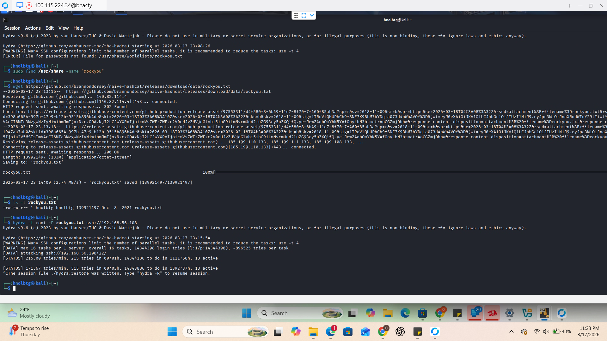
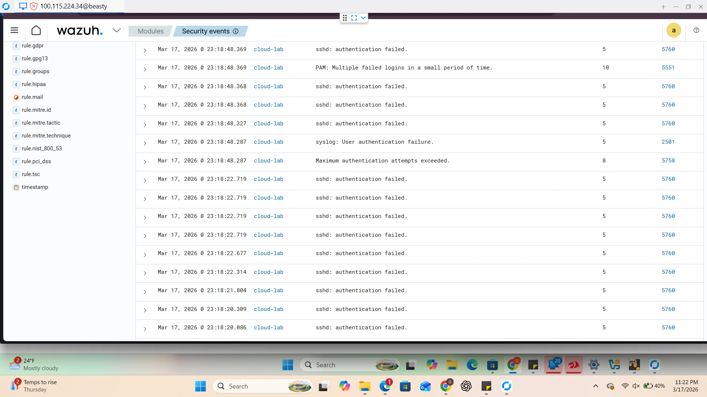

# Incident Response Report: SSH Brute-Force Detection (SOC / DFIR Style)
**Project:** Hybrid Private Cloud Architecture  
**Architects:** Oscar Lopez-Bolanos & Patrick Cassibry 
**Framework:** NIST SP 800-61 Rev. 2  
**Target Node:** `cloud-lab` (Ubuntu Server)  

---

## 1. Incident Summary
On March 17, 2026, the Wazuh SIEM triggered a critical Level 10 alert. A high-velocity authentication attack was detected originating from the Kali Linux testing node, targeting the SSH service on the `cloud-lab` server. This report documents the successful detection and mitigation of a dictionary-based brute-force attempt.

## 2. Timeline of Events
| Timestamp | Event Action | Evidence Source |
| :--- | :--- | :--- |
| **23:13:16** | Acquisition of `rockyou.txt` wordlist (Weaponization) | Kali Terminal |
| **23:15:54** | Initiation of Hydra SSH Brute-Force Attack | Kali Terminal |
| **23:18:22** | Generation of Level 10 PAM Authentication Alert | Wazuh Manager |
| **23:18:48** | Maximum authentication attempts exceeded; Connection dropped | Wazuh Dashboard |

---

## 3. Detection & Analysis (Evidence)
> **Functional Purpose:** This phase validates our "Visibility Loop." We simulate an attacker using a massive password dictionary to see if our SIEM can distinguish between a "forgotten password" and a "machine-driven attack."

### **Technical Note: Dictionary Attacks vs. Pure Brute Force**
While a pure brute-force attack tries every possible character combination, a **Dictionary Attack** (like our Hydra simulation) uses a pre-compiled list of common passwords. By downloading `rockyou.txt`, the attacker significantly reduces the time needed to crack a weak account.

### **Evidence Gallery**
#### **Screenshot 1.0: Attacker Weaponization (Hydra + RockYou)**

* **Analysis:** As seen in Screenshot 1.0, the attacker utilized `wget` to pull the `rockyou.txt` wordlist before launching **Hydra**. This demonstrates the **Weaponization** phase of the Cyber Kill Chain.

#### **Screenshot 2.0: SOC Alert Correlation**

* **Analysis:** Screenshot 2.0 shows the Wazuh Dashboard correlating hundreds of failed login attempts. **Rule 5551 (Level 10)** was triggered, identifying "Multiple failed logins in a small period of time"—the definitive signature of a brute-force tool.

---

## 4. Response Actions (NIST Lifecycle)

### **Phase 1: Detection & Analysis**
* Captured real-time SSH failure logs. 
* Identified the source IP as the internal Kali testing node, confirming a simulated security event rather than an external breach.

### **Phase 2: Containment**
> **Functional Purpose:** Stopping the "bleeding." In a production environment, this would trigger an automated block (e.g., Fail2Ban) to ban the attacker's IP at the firewall level.
* **Action:** Verified that the `root` account remained locked and no successful "Authentication Succeeded" logs followed the attack.

### **Phase 3: Eradication & Recovery**
* **Action:** Terminated the Hydra process on the attacking node. 
* **Recovery:** Hardened the SSH configuration by disabling root login and enforcing SSH Key-Based authentication to render dictionary attacks useless.

---

## 5. The Real-World Cost of Inaction
> **Strategic Note:** Identity is the new perimeter. If a brute-force attack is not detected and stopped, the cost to the business is absolute.

* **The "Keys to the Kingdom":** A successful brute force on the `root` account gives an attacker full administrative control. They can install "Persistence" (backdoors) that remain even after a reboot.
* **Ransomware Deployment:** Most ransomware attacks begin with a single compromised credential. Once inside, the attacker uses the server to encrypt the **Nextcloud** storage and **pfSense** backups.
* **Reputational Ruin:** If customer data is leaked via a compromised admin account, the legal fees and loss of brand trust often exceed the cost of the hardware itself.

---

## 6. Lessons Learned & Recommendations
* **Insight:** Standard password-based authentication is vulnerable to high-velocity tools like Hydra.
* **Recommendation:** Implement **Multi-Factor Authentication (MFA)** and disable password-based SSH logins entirely.
* **Automation:** Integrate **Fail2Ban** with Wazuh to automatically update pfSense firewall rules to block IPs after 3 failed attempts.

---
