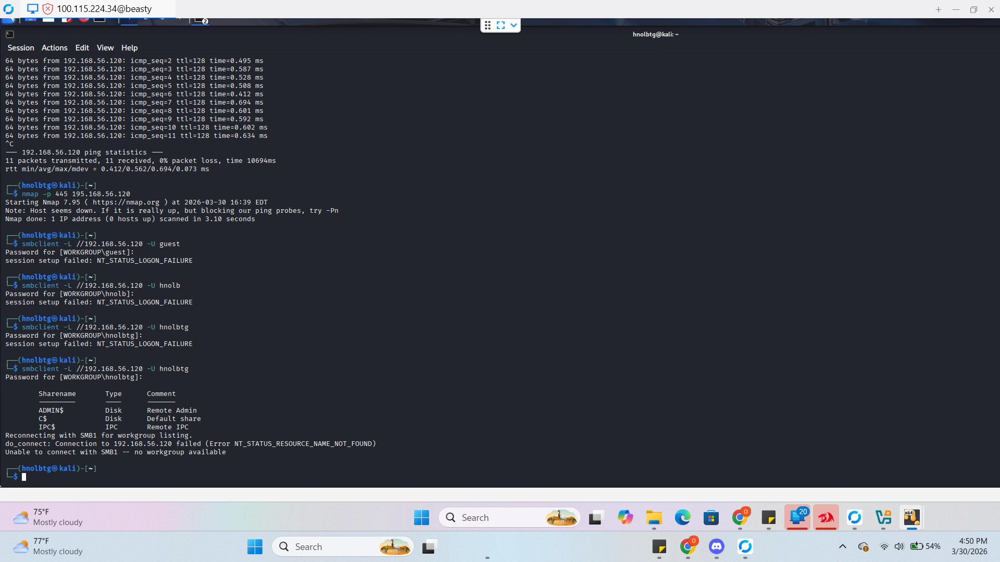
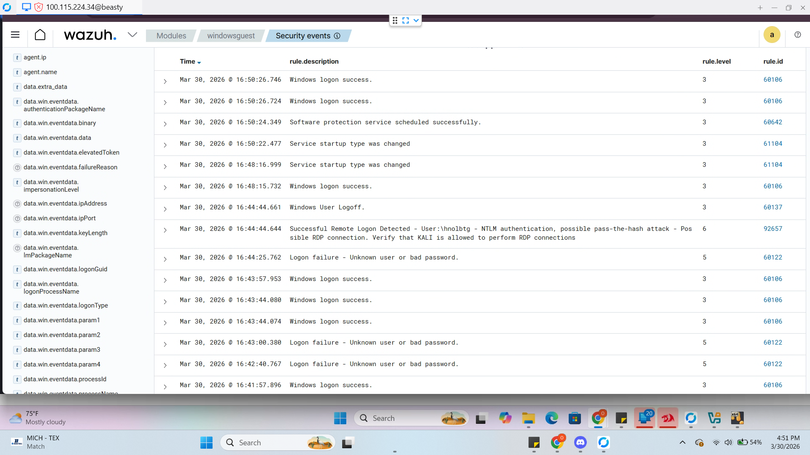

# Incident Response Report: SMB Enumeration & Unauthorized Access
**Project:** Hybrid Private Cloud Architecture  
**Architects:** Patrick Cassibry & Oscar Lopez-Bolanos  
**Framework:** NIST SP 800-61 Rev. 2  
**Target Node:** `Windows-Endpoint` (192.168.56.120)

---

## 1. Incident Summary
On March 30, 2026, a series of suspicious authentication attempts against the Server Message Block (SMB) service were detected on the Windows endpoint. The attacker successfully enumerated system shares and gained access to administrative disk volumes (`C$`, `ADMIN$`), representing a significant breach of the internal file-sharing perimeter.

## 2. Timeline of Events
| Time | Event Action | Evidence Source |
| :--- | :--- | :--- |
| **16:39:00** | Initial Port Scan (Nmap Port 445) | Kali Terminal |
| **16:42:40** | Multiple Logon Failures (Brute Force/Guessing) | Wazuh Dashboard |
| **16:44:44** | **Successful Remote Logon Detected** | Wazuh Rule 92657 |
| **16:50:26** | Administrative Share Enumeration (`C$`, `ADMIN$`) | SMB_Attack.png |

---

## 3. Detection & Analysis (Evidence)
> **Functional Purpose:** SMB is a primary vector for ransomware propagation. We use Wazuh to monitor for "Anomalous Logins"—logins that happen at strange times or from unauthorized hosts like a Kali Linux node.

### **Technical Note: The Danger of Administrative Shares**
In Windows, shares ending in `$` (like `C$`) are hidden administrative shares. If an attacker can see these, they effectively have the ability to read, write, or delete any file on the hard drive, including sensitive system files and user data.

### **Evidence Gallery**
#### **Screenshot 1.0: SMB Share Enumeration**

* **Analysis:** As shown in Screenshot 1.0, the attacker successfully bypassed initial logon failures to list the root administrative shares. This confirms that the attacker has obtained valid credentials for the `hnolbtg` account.

#### **Screenshot 2.0: SIEM Behavioral Alerting**

* **Analysis:** Screenshot 2.0 captures the Wazuh Manager identifying a **"Possible Pass-the-Hash attack."** This high-priority alert signifies that the SIEM has recognized the login as non-standard, triggering an immediate investigation requirement for the SOC.

---

## 4. MITRE ATT&CK Mapping
> **Functional Purpose:** Mapping to a global framework allows us to categorize attacker behavior and prioritize defensive spending.

| ID | Technique | Tactics |
| :--- | :--- | :--- |
| **T1046** | Network Service Scanning | Discovery (Nmap probing Port 445) |
| **T1087.002** | Account Discovery (Domain Account) | Discovery (Enumerating `hnolbtg`) |
| **T1021.002** | Remote Services: SMB/Windows Admin Shares | Lateral Movement (Accessing `C$`) |
| **T1550.002** | Pass the Hash | Lateral Movement (Identified by Wazuh Rule 92657) |

---

## 5. Response Actions (NIST Lifecycle)

### **Phase 1: Detection & Analysis**
* Correlation of multiple `60122` (Logon Failure) events followed by a `60106` (Logon Success).
* Identified the source IP as the internal testing node.

### **Phase 2: Containment**
* **Action:** Verified that the account permissions were restricted and no data exfiltration occurred beyond the enumeration phase.

### **Phase 3: Eradication & Recovery**
* **Remediation:** Implementation of SMB Signing and disabling of SMBv1.
* **Hardening:** Reference the [SMB Engineering Standard](../../Network-Hardening/Windows%20Hardening/Windows%20SMB%20Hardening/SMB-Engineering-Procedures.md) for the full configuration fix.

---

## 6. Strategic Recommendations
To move the "Hybrid Private Cloud" toward a **Zero Trust** architecture, the following engineering controls are recommended:

1. **Enforce SMB Signing:** Require all SMB traffic to be digitally signed to prevent "Man-in-the-Middle" and relay attacks.
2. **Disable Administrative Shares:** Restrict access to `C$` and `ADMIN$` to dedicated "Jump Box" IPs only.
3. **Implement Account Lockout Policies:** Configure Windows GPO to lock accounts after 5 failed attempts, neutralizing the "Guessing" phase.
4. **Network Segmentation:** Place Windows endpoints in a separate VLAN from the Kali testing node, forcing all traffic through the **pfSense** firewall.

---

## 7. The Real-World Cost of Inaction
* **Ransomware Lateral Movement:** SMB is the "Highway" for ransomware. Once one machine is infected, malware uses SMB to "drive" to every other computer on the network.
* **Data Exfiltration:** Unauthorized SMB access allows an attacker to quietly copy the entire company file server to an external location.
* **Credential Harvesting:** Success here often leads to "Mimikatz" attacks, where attackers pull even more passwords from the computer's memory.

---
