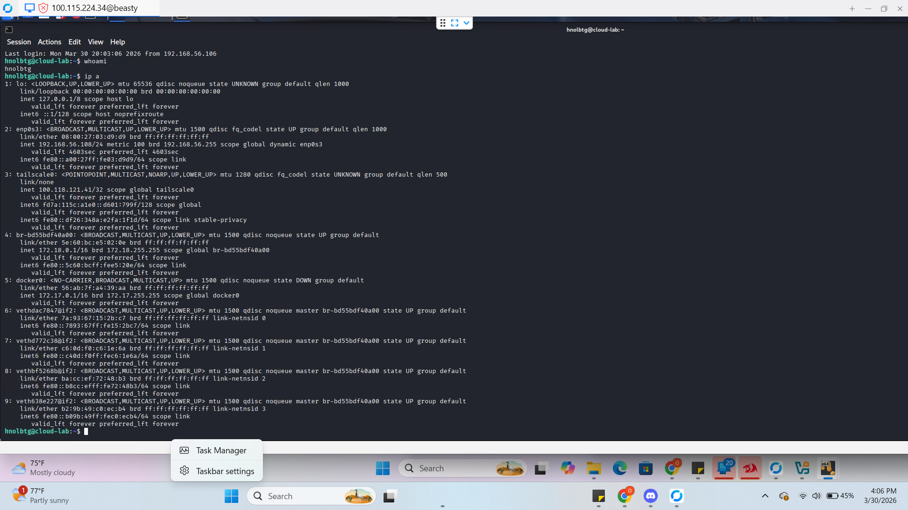
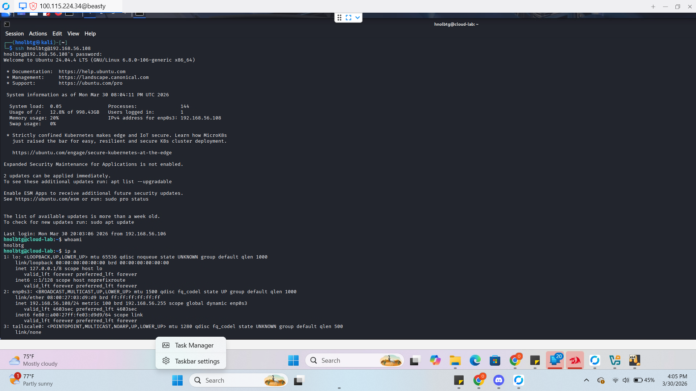
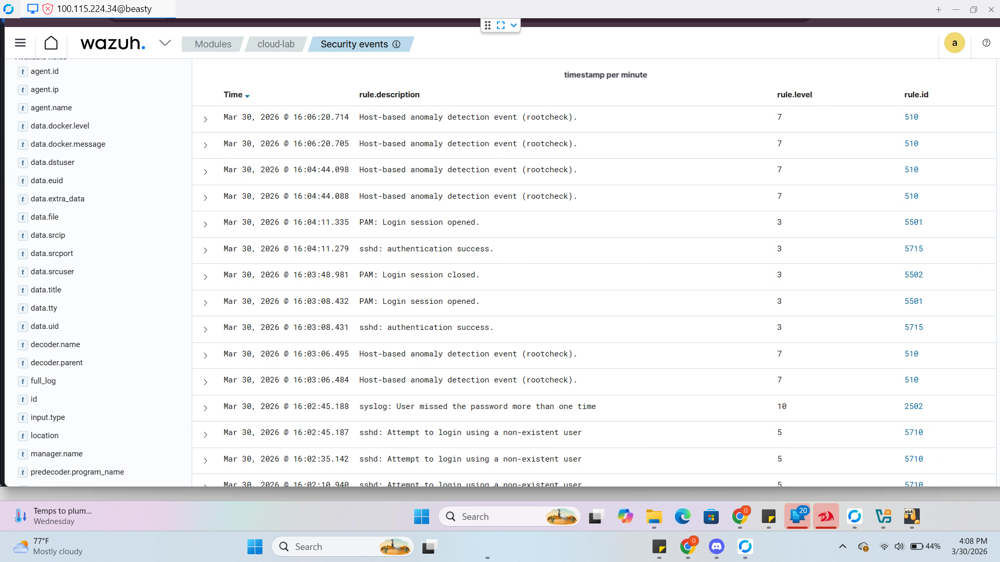

# Incident Response Report: Lateral Movement via SSH Pivot
**Project:** Hybrid Private Cloud Architecture  
**Architects:** Patrick Cassibry & Oscar Lopez-Bolanos  
**Framework:** NIST SP 800-61 Rev. 2  
**Target Node:** `cloud-lab` (Pivot Point) to `internal-node` (192.168.56.108)

---

### **Definitions & Core Tooling**
> **Lateral Movement:** The process where an attacker "moves" from a compromised host to other systems within the internal network.
> **SSH Pivot:** The technique of using a compromised host as a "stepping stone" to access internal assets that are not directly exposed to the internet.
> **East-West Security:** Protecting communication between servers *inside* the network, rather than just protecting the perimeter.

---

## 1. Incident Summary
On March 30, 2026, a lateral movement attempt was detected originating from the `cloud-lab` server. After an initial compromise, the attacker performed internal network enumeration and attempted to "pivot" to a secondary internal node via SSH. The Wazuh SIEM successfully identified unauthorized internal scanning and brute-force authentication signatures.

## 2. Timeline of Events
| Time | Event Action | Evidence Source |
| :--- | :--- | :--- |
| **16:02:45** | Attempt to login using a non-existent user | Wazuh Rule 5710 |
| **16:03:08** | **Successful SSH Authentication** (Toehold gained) | Wazuh Rule 5715 |
| **16:05:00** | Internal Enumeration (`ip a`, `whoami`) | Internal_Enumeration.png |
| **16:06:20** | **Host-based Anomaly Detection (Rootcheck)** | Wazuh_Logs.png |
| **16:08:44** | Lateral Pivot Attempt (SSH to 192.168.56.108) | SSH_Pivot.png |

---

## 3. Detection & Analysis (Evidence)
> **Functional Purpose:** Lateral movement is the "Pivot" where a simple breach becomes a total network takeover. By monitoring internal SSH traffic, we verify that our "East-West" traffic is just as secure as our "North-South" traffic.

### **Technical Note: The Pivot Technique**
A "Pivot" or "Jump" allows an attacker to bypass perimeter firewalls. In this simulation, the attacker used the `cloud-lab` server as a proxy to reach deeper internal assets that are not exposed to the public internet.

### **Evidence Gallery**
#### **Screenshot 1.0: Internal Network Mapping**

* **Analysis:** Screenshot 1.0 shows the attacker identifying internal subnets and Docker bridges. This is the **Discovery** phase of the MITRE ATT&CK framework.

#### **Screenshot 2.0: The Lateral Jump**

* **Analysis:** Screenshot 2.0 captures the manual SSH connection from the pivot host to the target. This confirms the attacker is attempting to spread throughout the internal architecture.

#### **Screenshot 3.0: SIEM Anomaly Detection**

* **Analysis:** Screenshot 3.0 shows Wazuh triggering **Rule 510 (Level 7)** for Rootcheck and **Rule 2502 (Level 10)**. This indicates that the SIEM recognized the anomalous behavior of an internal host suddenly acting as an attacker.

---

## 4. MITRE ATT&CK Mapping
| ID | Technique | Tactics |
| :--- | :--- | :--- |
| **T1082** | System Information Discovery | Discovery (Running `ip a`) |
| **T1021.004** | Remote Services: SSH | Lateral Movement (Pivoting between nodes) |
| **T1110.001** | Brute Force: Password Guessing | Credential Access (Internal SSH attempts) |

---

## 5. Response Actions (NIST Lifecycle)

### **Phase 1: Detection & Analysis**
* Noted a successful login from an authorized IP, followed immediately by internal discovery commands.
* Identified multiple failed logins to a *second* internal machine, indicating a pivot attempt.

### **Phase 2: Containment**
* **Action:** Isolated the compromised `cloud-lab` node at the **pfSense** firewall level to prevent further internal "East-West" movement.
* **Action:** Terminated all active SSH sessions for the `hnolbtg` user.

### **Phase 3: Eradication & Recovery**
* **Remediation:** Audited SSH logs to ensure no other nodes were reached. 
* **Hardening:** Implemented **SSH Key-Based Auth** and restricted SSH access to specific management IPs.

---

## 6. Strategic Recommendations
1. **Zero Trust Micro-segmentation:** Configure **pfSense** to block all SSH traffic between internal servers unless explicitly required for administrative tasks.
2. **Behavioral Baselining:** Tune Wazuh to alert on any internal host running network discovery tools like `nmap` or `ip a`.
3. **MFA for Internal Pivot:** Require Multi-Factor Authentication even for internal SSH connections to prevent stolen credentials from being used to move laterally.

---

## 7. Real-World Cost of Inaction
* **Complete Domain Compromise:** Lateral movement allows an attacker to "hoover up" credentials from every machine they touch until they reach the Domain Controller or Admin console.
* **Data Silo Breach:** Even if your data is "hidden" in an internal database server, a successful pivot makes it accessible.
* **Advanced Persistent Threat (APT):** Once an attacker has moved laterally, they are much harder to find and remove, as they often hide in multiple parts of the network simultaneously.

---
