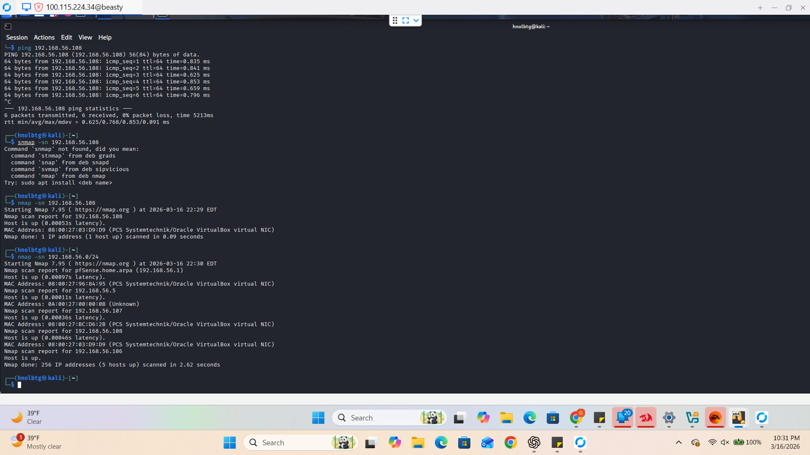

# Incident Response Report: Network Reconnaissance & Discovery
**Project:** Hybrid Private Cloud Architecture  
**Architects:** Oscar Lopez-Bolanos & Patrick Cassibry
**Framework:** NIST SP 800-61 Rev. 2  
**Target:** Internal Management Subnet (192.168.56.0/24)

---

### **Definitions & Core Tooling**
> **Functional Purpose:** To ensure architectural clarity, we define the primary concepts used in this security validation:
> * **Reconnaissance:** The initial phase of an attack where information is gathered about a target network to identify vulnerabilities.
> * **Nmap (Network Mapper):** An industry-standard tool used for network discovery and security auditing. It identifies live hosts, open ports, and operating system versions.
> * **ICMP Sweep (Ping Sweep):** A technique used to determine which range of IP addresses map to live hosts by sending ICMP ECHO requests.

---

## 1. Incident Summary
On March 16, 2026, a high-volume network discovery scan was detected targeting the internal management subnet. The scan utilized ICMP echo requests to map the active inventory of the environment. The attacker successfully identified five live nodes, including the primary pfSense gateway and multiple cloud-lab instances.

## 2. Timeline of Events
| Time | Event Action | Evidence Source |
| :--- | :--- | :--- |
| **22:29:15** | Directed Ping to 192.168.56.108 | Kali_Attacker.png |
| **22:30:05** | **Subnet Sweep Initiated** (192.168.56.0/24) | Kali_Attacker.png |
| **22:30:08** | Host Discovery Completed (5 Hosts Identified) | Kali_Attacker.png |
| **22:31:00** | Wazuh Correlation of Discovery Signatures | Wazuh Manager |

---

## 3. Detection & Analysis (Evidence)
> **Functional Purpose:** Reconnaissance is the "Pre-Attack" phase. Detecting an Nmap sweep allows a SOC to move to an active defense posture before an actual breach (like SSH brute-forcing) occurs.

### **Technical Note: The "Noise" of Nmap**
While Nmap is a powerful tool for administrators, its default scanning behavior is "noisy." By attempting to contact every IP in a `/24` range, the attacker leaves a definitive footprint in the firewall logs and SIEM.

### **Evidence Gallery**
#### **Screenshot 1.0: Network Discovery Execution**

* **Analysis:** As shown in the terminal evidence, the attacker moved from a single host probe to a full subnet sweep. This identifies the breadth of the target environment and provides the attacker with a list of IP addresses for follow-up exploitation.

---

## 4. MITRE ATT&CK Mapping
| ID | Technique | Tactics |
| :--- | :--- | :--- |
| **T1595** | Active Scanning | Reconnaissance (Hardware/Network probing) |
| **T1018** | Remote System Discovery | Discovery (Mapping live hosts via ICMP) |
| **T1046** | Network Service Scanning | Discovery (Identifying potential open ports) |

---

## 4. Response Actions (NIST Lifecycle)

### **Phase 1: Detection & Analysis**
* Captured logs of ICMP traffic originating from the Kali Linux testing node.
* Identified the scan as a "Ping Sweep" designed to map internal inventory.

### **Phase 2: Containment**
* **Action:** Configured **pfSense** firewall rules to limit ICMP traffic to authorized management IPs only.
* **Action:** Enabled "Block on Discovery" alerts in the Wazuh manager to flag subsequent port scans.

### **Phase 3: Eradication & Recovery**
* **Remediation:** Audited all discovered hosts to ensure no non-essential services were exposed to the subnet.
* **Hardening:** Implemented rate-limiting on the pfSense gateway to mitigate the speed at which an attacker can scan the network.

---

## 5. Strategic Recommendations
1. **ICMP Hardening:** Disable "Ping Response" on all sensitive internal nodes unless required for monitoring.
2. **Honey-Pot Deployment:** Deploy a "Honey-IP" (an unused IP that should never have traffic). If Wazuh sees an Nmap scan hit that IP, it is a 100% confirmed intruder alert.
3. **Adaptive Firewalls:** Use Wazuh's **Active Response** to automatically block any IP that performs a scan exceeding a certain threshold of connection attempts.

---

## 6. Real-World Cost of Inaction
* **The "Blueprint" of the Network:** Allowing reconnaissance gives an attacker a map of your entire business. They know which servers are Windows, which are Linux, and where the Firewall is.
* **Efficient Exploitation:** Once a scan is successful, an attacker doesn't waste time on empty IPs; they can launch targeted, high-speed attacks (like **Hydra**) against the specific hosts they discovered.
* **Compliance Violation:** Many security frameworks (like **SOC2**) require businesses to monitor and block unauthorized network scanning to prevent information disclosure.

---
