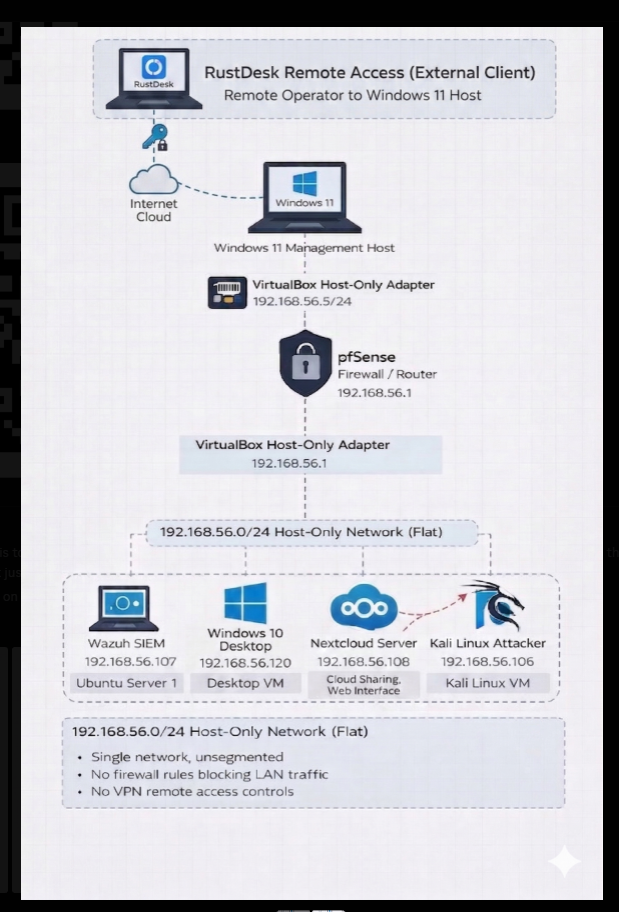
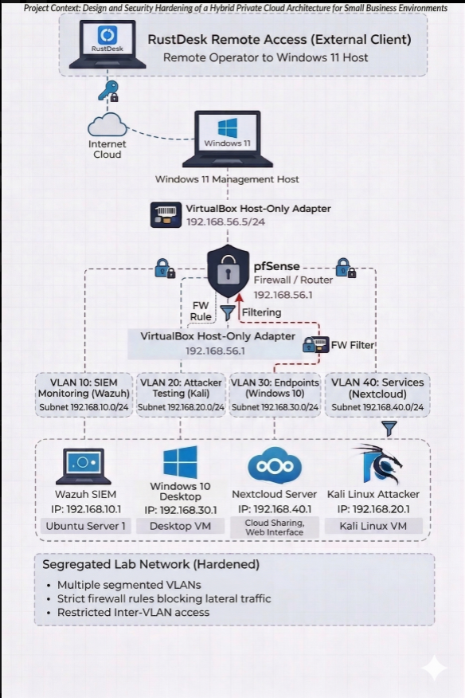

# Design and Security Hardening of a Hybrid Private Cloud Architecture 
Research Project for CSU Tower Day April 2026

Oscar Lopez-Bolanos & Patrick Cassibry
---

## 1. Project Overview
This project demonstrates the engineering and validation of a **Zero Trust** hybrid cloud environment designed for small business resilience. By integrating a centralized **Wazuh SIEM (SOC)** with a **pfSense-managed network**, we have built an architecture that not only defends against modern threats but provides full forensic visibility into every stage of the cyber kill chain.

### **Network Evolution: From Flat to Zero Trust**

| **Before: Traditional Flat Network** | **After: Zero Trust Segmented Architecture** |
| :---: | :---: |
|  |  |
| *Vulnerable "Flat" configuration where all devices share a single broadcast domain, allowing unrestricted lateral movement.* | *Hardened Enterprise-scale architecture utilizing VLANs and pfSense to enforce Zero Trust Isolation and Micro-segmentation.* |

> **Validation & Engineering:** The technical implementation of this transition is documented in our [**Network Segmentation Engineering Standard**](./Docs/Network-Hardening/Segmentation/Network-Segmentation-Engineering-Standard.md) and validated via our [**NIST Incident Response Report**](./Docs/Network-Hardening/Segmentation/NIST-Incident-Response-Segmentation.md).

---

## 2. The Core Architecture
Our environment is built on three fundamental pillars of security engineering:
1. **Network Authority:** A pfSense gateway enforcing micro-segmentation and ICMP suppression.
2. **Endpoint Integrity:** Hardened Linux and Windows nodes utilizing FIM (File Integrity Monitoring).
3. **Identity Defense:** Multi-factor authentication (MFA) and SSH key enforcement to neutralize credential-based attacks.

---

## 3. Security Validation Index (Deep Dive)
To explore the technical standards and NIST-aligned incident reports, navigate to the specific domains below:

### **🛡️ Phase 1: Defensive Hardening**
*Standards for building a resilient baseline.*
* [**Windows SMB Hardening**](./Docs/Network-Hardening/Windows%20Hardening/Windows%20SMB%20Hardening/) - Engineering standards for secure file sharing.
* [**Linux System Hardening**](./Docs/Network-Hardening/Linux-Hardening/) - Hardening the "Cloud-Lab" management node.

### **⚔️ Phase 2: Vulnerability Validation**
*Simulated exploits and forensic detection reports.*
* [**SSH Brute-Force (Hydra)**](./Docs/Vulnerability-Assesment/Hydra/) - Detection of high-velocity identity attacks.
* [**SMB Exploitation**](./Docs/Vulnerability-Assesment/SMB-Attack/) - Validating the risks of misconfigured administrative shares.
* [**Lateral Movement (SSH Pivot)**](./Docs/Vulnerability-Assesment/SSH%20Pivot%20(Lateral%20Movement)/) - Monitoring internal network hopping.
* [**Network Discovery (Nmap)**](./Docs/Vulnerability-Assesment/nmap/) - Identifying reconnaissance signatures.

### **🧠 Phase 3: The SOC Operations**
*The "Brain" of the architecture.*
* [**Wazuh Manager Configuration**](./Docs/Wazuh-Manager/) - Custom decoders, rulesets, and active response logic.

---

## Enterprise Hardening Roadmap (Recommendations)
To move this architecture from "Detection" to "Resilience," we recommend the following identity defense enhancements:
* **Multi-Factor Authentication (MFA):** Implementation of TOTP or Duo to secure administrative access points.
* **SSH Key-Based Authentication:** Disabling password-based logins entirely to neutralize dictionary and brute-force attacks.
* **Identity Provider (IdP) Integration:** Centralizing user management to enforce the **Principle of Least Privilege (PoLP)** across all cloud services.

---

## 4. Professional Impact
This project follows the **NIST SP 800-61 Rev. 2** incident response framework and utilizes the **MITRE ATT&CK** matrix to categorize threats. It serves as a proof-of-concept for how small-to-medium businesses can achieve enterprise-level security visibility using open-source tooling.

---

## 🛡️ Glossary of Architectural Principles
* **Zero Trust:** A security model that assumes the "perimeter" is already breached. It requires every user and device to be verified, even if they are already inside the network.
* **Micro-segmentation:** The practice of dividing a network into small, isolated zones (VLANs). This ensures that if one area is compromised, the threat is "trapped" and cannot spread.
* **Lateral Movement:** The process an attacker uses to "hop" from one compromised machine to another within a network.
* **Reconnaissance:** The preliminary "scouting" phase of an attack where an intruder maps out the network to find targets (e.g., using Nmap).
* **Defense-in-Depth:** A layered defense strategy. If the firewall fails, the host security catches it; if the host fails, the SIEM alerts the admin.
* **The CIA Triad:** The fundamental goals of security: **Confidentiality** (Privacy), **Integrity** (Data Accuracy), and **Availability** (Uptime).
* **SIEM (Security Information & Event Management):** The "Central Brain" (Wazuh) that collects and analyzes logs from every computer to find signs of an attack.

---
*Developed for CSU Tower Day 2026. For technical inquiries or forensic data review, please contact the architects.*
